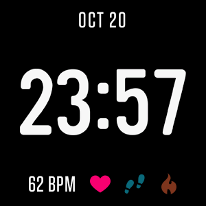

# Anti Layers
Fitbit Versa clock face inspired by [Layers](https://gallery.fitbit.com/details/0000146f-0000-4000-8000-000000f17b17) without overlapping clock numbers.  

  
  
Clock face in Fitbit gallery: [Not available yet](https://gallery.fitbit.com)  
Supported devices: Versa, Versa Lite, Versa 2 (coming soon)

## Build & Install
### Prerequisites
Before you get started see Fitbit [Getting Started](https://dev.fitbit.com/getting-started/) guide.  
To build app locally you need [Node.js](https://nodejs.org/en/download/) 8.x+ on macOS, Windows or Linux.  

### Install dependencies
```bash
npm install
```

### Build application
```bash
npx fitbit-build
npx fitbit
fitbit$ install
```
You can also rebuild from within the Fitbit shell:  
```bash
npx fitbit
fitbit$ build
fitbit$ install
# or
fitbit$ build-and-install
```
The first time you run the build command you’ll be prompted to create the default build script, answer Yes.  

For more info see [Command Line Interface Guide](https://dev.fitbit.com/build/guides/command-line-interface/) and [Fitbit SDK CLI](https://www.npmjs.com/package/@fitbit/sdk-cli).  

## Credits
[Volodymyr Stelmakh](https://github.com/vstelmakh)  
Licensed under the MIT License. See [LICENSE](LICENSE) for more information.  
